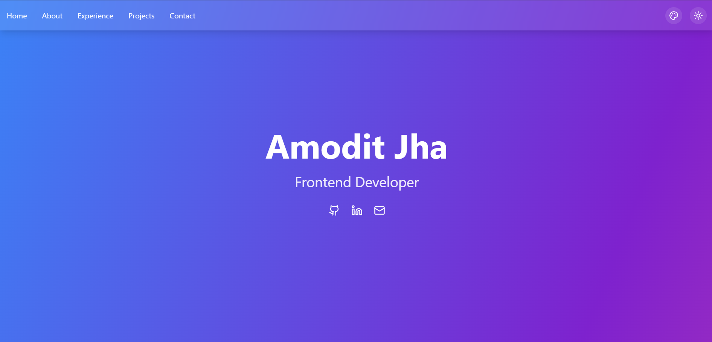

# 🚀 My Professional Portfolio

Welcome to my **personal portfolio**! This project showcases my skills, projects, and experience as a **UI Developer**, built using modern web technologies.

## 🔥 Tech Stack
- **Vite** – Lightning-fast build tool
- **React** – Modern UI library
- **TypeScript** – Strongly typed JavaScript
- **Tailwind CSS** – Utility-first CSS framework
- **Framer Motion** – Smooth animations and interactions
- **EmailJS** – Functional contact form integration

## 🎨 Features
- **Modern & Responsive Design** – Fully optimized for all devices
- **Smooth Animations** – Powered by Framer Motion
- **Interactive Contact Form** – Send messages via EmailJS
- **Project Showcase** – Displays my best work with descriptions and links
- **Performance Optimized** – Fast and efficient with Vite

## 📸 Preview


## 🛠️ Installation & Setup
To run this portfolio locally, follow these steps:

1. Clone the repository:
   ```bash
   git clone https://github.com/your-username/your-portfolio.git
   ```

2. Navigate to the project folder:
   ```bash
   cd your-portfolio
   ```

3. Install dependencies:
   ```bash
   npm install
   ```


4. Set up the `.env.local` file for EmailJS:
   ```bash
   touch .env.local
   ```
   Open `.env.local` and add the following environment variables:
   ```env
   VITE_EMAILJS_SERVICE_ID=your-service-id
   VITE_EMAILJS_TEMPLATE_ID=your-template-id
   VITE_EMAILJS_USER_ID=your-user-id
   ```

5. Start the development server:
   ```bash
   npm run dev
   ```

6. Open the app in your browser:
   ```
   http://localhost:5173
   ```

## 📬 Contact
If you have any questions or want to collaborate, feel free to reach out:
- **Portfolio:** https://amodits-portfolio.vercel.app/
- **Email:** amodit701@example.com
- **LinkedIn:** http://www.linkedin.com/in/amoditjha


## ⭐️ Show Your Support
If you like this project, consider giving it a **star** ⭐ on GitHub!

---
Made with ❤️ by Amodit Jha
